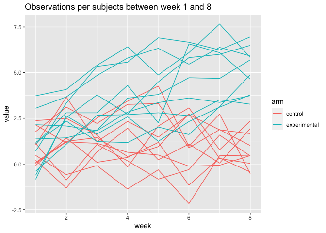
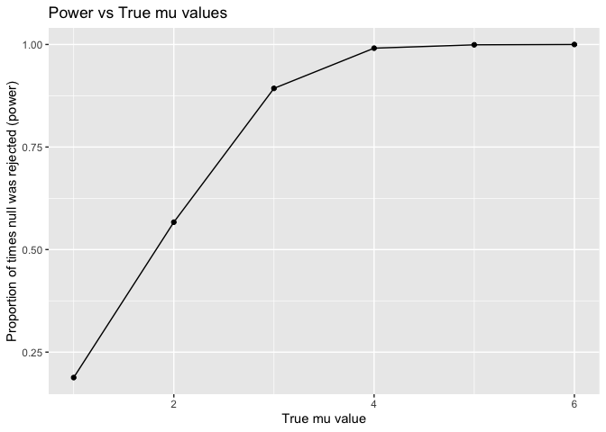
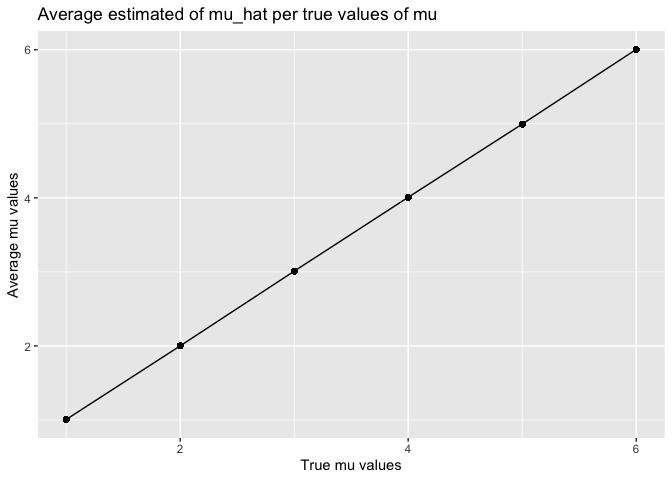
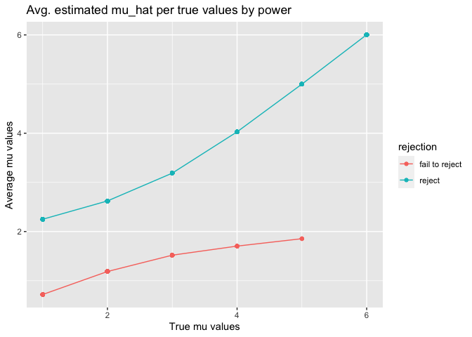

p8105\_hw5\_ga2612
================
Lupe Antonio
11/12/2023

## Problem 1

The raw data for this problem is based on data gathered by the
Washington Post on homicides in 50 large US cities.

``` r
#loading data
homicide_data <- read_csv('data_hw5/homicide_data.csv') %>%
  mutate(
    city_state = str_c(city, state, sep = ', '), 
    resolution = case_when(
      disposition == 'Closed without arrest' ~ 'unsolved',
      disposition == 'Open/No arrest' ~ 'unsolved',
      disposition == 'Closed by arrest' ~ 'solved')) %>%
  #excluding non-major cities
  filter(city_state != 'Tulsa, AL')
```

After cleaning the data, it has a total of 52178 entries with
demographic variables such as victim names, date of incident, victime
race, age, sex, and location of incident, etc. Additionally, the
`city_state` variable was created to combine and output location nicely;
`resolution` was also updated.

``` r
#df homicides totals & those unsolved
city_homicide <- homicide_data %>%
  select(city_state, disposition, resolution) %>%
  group_by(city_state) %>%
  summarize(
    total_homicides = n(),
    unsolved_homicides = sum(resolution == 'unsolved'))
```

``` r
#focusing on Balitmore
baltimore_prop = prop.test(
  x = filter(city_homicide, city_state == 'Baltimore, MD') %>% pull(unsolved_homicides),
  n = filter(city_homicide, city_state == 'Baltimore, MD') %>% pull(total_homicides))

baltimore_prop %>% tidy() %>%
  knitr::kable()
```

|  estimate | statistic | p.value | parameter |  conf.low | conf.high | method                                               | alternative |
| --------: | --------: | ------: | --------: | --------: | --------: | :--------------------------------------------------- | :---------- |
| 0.6455607 |   239.011 |       0 |         1 | 0.6275625 | 0.6631599 | 1-sample proportions test with continuity correction | two.sided   |

``` r
#creating tidy prop.test results
prop_test_results <- city_homicide %>%
  mutate(
    prop_tests = map2(unsolved_homicides, total_homicides, \(x, y) prop.test(x = x, n = y)),
    tidy_tests = map(prop_tests, tidy)) %>%
  select(-prop_tests) %>%
  unnest(tidy_tests) %>%
  select(city_state, estimate, conf.low, conf.high) %>%
  mutate(
    city_state = fct_reorder(city_state, estimate))
```

``` r
#plot
prop_test_results %>%
  mutate(city_state = fct_reorder(city_state, estimate)) %>%
  ggplot(aes(x = city_state, y = estimate)) +
  geom_point() +
  geom_errorbar(aes(ymin = conf.low, ymax = conf.high)) +
  theme(axis.text.x = element_text(angle = 90, hjust = 1))
```

<!-- -->

## Problem 2

``` r
#loading data
file_names <- list.files(path = 'data_hw5/p2_data') %>%
  as_tibble() %>%
  rename(file_name = value) %>%
  #iterating over file names, reading file, and create new variable in df
  mutate(
    data = map(str_c('./data_hw5/p2_data/', file_name), read_csv)) %>%
  unnest(cols = data) %>%
  pivot_longer(week_1:week_8,
               names_to = 'week',
               values_to = 'value') %>%
  mutate(
    #creating arm variable for either control or experimental
    arm = case_when(
      str_detect(file_name, 'con') ~ 'control',
      TRUE ~ 'experimental'),
    
    #creating subject id variable
    id = as.numeric(str_sub(file_name, start = 5, end = 6)),
    
    #updating week to numeric
    week = as.numeric(str_sub(week, start = 6, end = 6)))
```

``` r
#creating plot
file_names %>%
  ggplot(aes(x = week, y = value, color = arm, group = interaction(id, arm))) +
  geom_line() +
  ggtitle('Observations per subjects between week 1 and 8')
```

<!-- -->

Based on the plot above, we can see that over time the participants with
the experimental arm had increasing values over time. While those with
the control arm had relatively consistent values over time, not much
fluctuation.

## Problem 3

Make a plot showing the proportion of times the null was rejected (the
power of the test) on the y axis and the true value of μ on the x axis.
Describe the association between effect size and power.

Make a plot showing the average estimate of μ̂ on the y axis and the
true value of μ on the x axis.

Make a second plot (or overlay on the first) the average estimate of μ̂
only in samples for which the null was rejected on the y axis and the
true value of μ on the x axis. Is the sample average of μ̂ across tests
for which the null is rejected approximately equal to the true value of
μ? Why or why not?

``` r
sim_mean_pval <- function(mean, n = 30,sigma = 5){
  sim_data = tibble(
    x = rnorm(n = n, mean = mean, sd = sigma))
  
  mean_pval = sim_data %>%
    pull(x) %>%
    #.95 for conf.level, 0 mu is already preset. 
    t.test() %>%
    tidy() %>%
    select(estimate, p.value)
  
  return(mean_pval)}
```

``` r
#df for all iterations
sim_results_df <- expand_grid(
  iter = 1:5000,
  alternate_mus = c(1, 2, 3, 4, 5, 6)) %>%
  mutate(
    values_df = map(alternate_mus, sim_mean_pval)) %>%
  unnest(values_df)
```

Make a plot showing the proportion of times the null was rejected (the
power of the test) on the y axis and the true value of μ on the x axis.
Describe the association between effect size and power.

``` r
#plot1
sim_results_df %>%
  group_by(alternate_mus) %>%
  summarize(power = mean(p.value < 0.05)) %>%
  ggplot(aes(x = alternate_mus, y = power)) +
  geom_point() +
  geom_line() + 
  xlab('True mu value') +
  ylab('Proportion of times null was rejected (power)') + 
  ggtitle('Power vs True mu values')
```

<!-- -->

``` r
#plot2
sim_results_df %>%
  group_by(alternate_mus) %>%
  mutate(average_mu_values= mean(estimate)) %>%
  ggplot(aes(x = alternate_mus, y = average_mu_values)) +
  geom_point() +
  geom_line() +
  xlab('True mu values') +
  ylab('Average mu values') +
  ggtitle('Average estimated of mu_hat per true values of mu')
```

<!-- --> We
can see that after averaging all the mu’s per the 5000 iterations it
equals to it’s original/true mu value. Since we have a high number of
iterations, this makes sense.

``` r
#plot3
sim_results_df %>%
  mutate(
    rejection = case_when(
      p.value < 0.05 ~ 'reject',
      TRUE ~ 'fail to reject')) %>%
  group_by(alternate_mus, rejection) %>%
  mutate(average_mu_values= mean(estimate)) %>%
  ggplot(aes(x = alternate_mus, y = average_mu_values, color = rejection)) +
  geom_point() +
  geom_line() +
  xlab('True mu values') +
  ylab('Average mu values') +
  ggtitle('Avg. estimated mu_hat per true values by power') 
```

<!-- -->

From the plot above, we can see that for those that failed to reject,
the average mu values are being pulled closer to 0. This makes sense
since the null hypothesis is that
 = 0, thus if we are failing to reject, it is likely that the
’s are closer to zero. The plot proves this.
